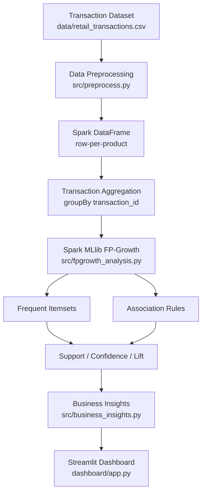

# System Architecture — Scalable Market Basket Analysis

## 1. High-Level Pipeline



## 2. Component Breakdown

### 2.1 Dataset Generation (`src/generate_dataset.py`)
Generates a synthetic but realistic retail transaction dataset. Each
transaction (basket) is built by:
1. Randomly selecting a handful of "base" products.
2. Probabilistically adding "companion" products based on a small set
   of seeded relationships (e.g. Bread → Butter with 55% probability),
   so genuine co-purchase patterns exist for FP-Growth to discover.
3. Injecting a small amount of realistic data-quality noise (duplicate
   rows, missing product names, invalid quantities/prices) so the
   preprocessing stage has real work to do.

Output: one CSV row per (transaction, product) pair.

### 2.2 Data Preprocessing (`src/preprocess.py`)
Implemented entirely with **Spark DataFrames** (not pandas), since this
is the "big data / distributed processing" component of the project.
Steps:
1. Load CSV into a Spark DataFrame with schema inference.
2. Validate required columns exist; fail fast with a clear error if not.
3. Filter out rows with null/blank `transaction_id`.
4. Filter out rows with null/blank `product_name`.
5. Filter out rows with invalid (`<= 0`) `quantity`.
6. Filter out rows with invalid (`<= 0`) `price`.
7. Drop duplicate `(transaction_id, product_id)` rows.
8. `groupBy(transaction_id)` + `collect_set(product_name)` to produce
   one row per transaction with an `items: array<string>` column — the
   exact input shape `pyspark.ml.fpm.FPGrowth` requires.

### 2.3 Spark Session / Distributed Processing (`src/fpgrowth_analysis.py::get_spark_session`)
A local Spark session is created with `master("local[*]")`, meaning
Spark partitions and distributes work across **all available CPU
cores** on the machine, even though it's a single laptop. Because the
code is written entirely against the Spark DataFrame/MLlib APIs (not
tied to any local-only construct), the exact same code would run
unmodified on a real multi-node Spark cluster by simply changing
`SPARK_MASTER` in `config/config.py` (e.g. to `spark://<master-host>:7077`
or a YARN/Kubernetes master URL).

### 2.4 FP-Growth Frequent Pattern Mining (`src/fpgrowth_analysis.py`)
Uses **`pyspark.ml.fpm.FPGrowth`** — Spark's distributed implementation
of the FP-Growth algorithm — to:
1. Build an FP-tree representation of all transactions.
2. Mine frequent itemsets that appear in at least `minSupport` fraction
   of transactions.
3. Generate association rules from those itemsets that meet
   `minConfidence`.

Both thresholds are configurable (`config/config.py` defaults:
`minSupport=0.01`, `minConfidence=0.2`) and can be overridden via CLI
arguments or the pipeline script.

### 2.5 Association Rule Analysis
Each rule `[antecedent] → [consequent]` is annotated with:
- **Support** — how often the itemset (antecedent ∪ consequent)
  appears across all transactions.
- **Confidence** — P(consequent | antecedent): how often the
  consequent is bought when the antecedent is bought.
- **Lift** — confidence divided by the consequent's baseline support;
  lift > 1 means the products are positively associated (bought
  together more than chance would predict).

### 2.6 Business Insights (`src/business_insights.py`)
Post-processes the raw rules/itemsets into retailer-friendly
categories: frequent combinations, strong associations (high lift),
cross-selling opportunities (high confidence + high lift, single-item
antecedent), top lift pairs, and category-level relationships. Every
insight is derived programmatically from the actual FP-Growth output.

### 2.7 Performance / Scalability Testing (`src/performance_test.py`)
Re-runs the preprocessing + FP-Growth pipeline across multiple dataset
sizes (10K / 50K / 100K / 500K transactions by default), measuring
wall-clock time for each stage and throughput (transactions/second).
Results are saved as CSV and a 4-panel matplotlib chart.

### 2.8 Master Pipeline (`src/run_pipeline.py`)
Orchestrates dataset generation (if needed) → Spark init →
preprocessing → FP-Growth → association rules → business insights →
evaluation summary, writing all outputs to `results/` so the dashboard
never needs to re-run Spark itself.

### 2.9 Streamlit Dashboard (`dashboard/app.py`)
A read-only presentation layer over the files in `results/`:
overview metrics, sortable/filterable itemsets and rules tables,
7 different Plotly visualizations (including a NetworkX-based
association network and a category-level heatmap), an interactive
product search, business insights browser, and performance charts.

## 3. Why Spark Instead of Pure Python/Pandas?

- **Distributed execution**: Spark partitions transaction data across
  cores/nodes and processes partitions in parallel, unlike single-
  threaded pandas operations.
- **Scalable FP-Growth**: `pyspark.ml.fpm.FPGrowth` is a genuinely
  distributed implementation (parallel FP-growth, based on the Li et
  al. PFP paper) designed for datasets far larger than fit comfortably
  in a single pandas DataFrame in memory.
- **Same code, bigger cluster**: The exact same preprocessing and
  FP-Growth code scales from a laptop (`local[*]`) to a real cluster by
  changing one configuration string, with no code rewrite.

## 4. Data Flow Summary

```
CSV (row per product)
   -> Spark DataFrame (cleaned, row per product)
   -> Spark DataFrame (row per transaction, items: array<string>)
   -> FPGrowthModel (freqItemsets, associationRules)
   -> pandas DataFrames (clean, sorted, renamed columns)
   -> CSV files in results/
   -> Streamlit dashboard (reads CSVs only)
```
